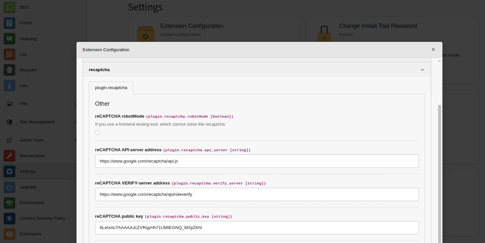

.. ==================================================
.. FOR YOUR INFORMATION
.. --------------------------------------------------
.. -*- coding: utf-8 -*- with BOM.

.. include:: ./Images.txt
.. include:: ../Includes.txt

Administration
==============

Installation for both TYPO3 CMS installation types (manual/composer)
are supported. For both a compatible installation is provided.

Manual installations
--------------------

Download the extension recaptcha either with the browser from typo3.org_
or github_ and upload it into the installation in the admin tools extensions,
or directly in the admin tools extensions with the integrated search.

Composer installations
----------------------

On the console in the folder where the project composer.json resides
just type:

.. code-block:: bash
   :caption: Installation via composer

   composer require evoweb/recaptcha ^8.2
   composer update

Activation
----------

After the extension is installed by either way you always need to activate
it. Normally this is done in the admin tools extensions. But its also possible
to activate it via console:

.. code-block:: bash
   :caption: Activate extension on shell

   $ ./bin/typo3 extensionmanager:extension:install recaptcha

Configuration
-------------

If, the captcha should be usable in backend context or you like to have
a default configuration without touching TypoScript, the extensions
need to be configured in the admin tools extensions. Via the cog as shown
on the screenshot.

.. _typo3.org: http://extenions.typo3.org/
.. _github: https://github.com/evoweb/recaptcha
