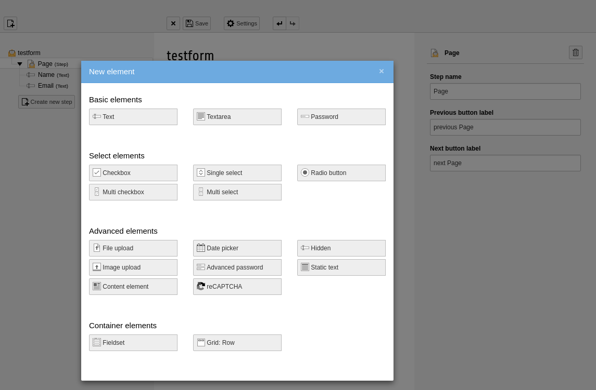
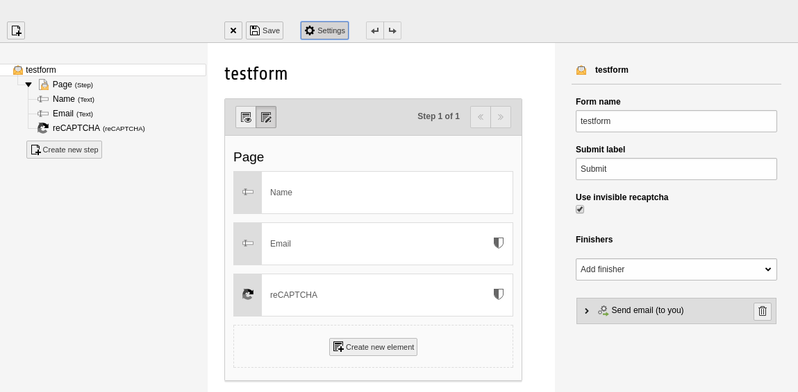

.. include:: /Includes.rst.txt

.. _user-manual:

============
Users manual
============

Usage in ext:form manager
-------------------------

This extension doesn't come with a content element of any sort. As
it is only a service the captcha can't be used on its own. But there
is one part where editors are able to have the possibility to configure
captcha related settings.

Add captcha to form
~~~~~~~~~~~~~~~~~~~

In the form manager it's possible to add the captcha to a form by
choosing it in the new field wizard.

Configure label
~~~~~~~~~~~~~~~

After the selection the user is able to choose if the label should be
rendered in frontend and if so what label text should be used.

.. figure:: Images/added_recaptcha.png
   :alt: Add recaptcha element in form

Use invisible captcha
~~~~~~~~~~~~~~~~~~~~~

To use the invisible reCAPTCHA it's necessary to add an captcha field.
Once this is done the form needs to be configured via the settings
button on top of the form editor. There the checkbox for
"Use invisible recaptcha" needs to be checked.

Usage in ext:formhandler
------------------------

The invisible mode is only supported at the moment.

Marker for the hidden field:

.. code-block:: html
    :linenos:

    ###recaptcha_invisible###

Marker for the submit button:

.. code-block:: html
    :linenos:

    ###recaptcha_button_invisible###
